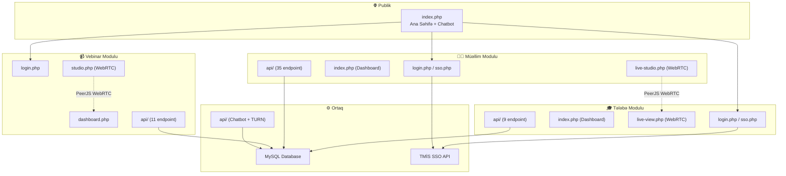

# 📁 NDU Distant Təhsil Sistemi — Fayl Strukturu

> **Texnologiya:** PHP + MySQL | **Modullar:** Tələbə, Müəllim, Vebinar
> **TMİS SSO** ilə inteqrasiya, **WebRTC (PeerJS)** ilə canlı dərs, **AI Chatbot** daxildir.

---

## 🏠 Kök Qovluq (`/`)

| Fayl | Təyinat |
|------|---------|
| `index.php` | **Publik ana səhifə** — canlı dərslərin cədvəli, arxiv, statistika, AI chatbot widget, login dropdown. Sayta daxil olan hər kəs bunu görür. |
| `.env.example` | **Nümunə konfiqurasiya** — DB, TMİS SSO, TURN server (Metered.ca) üçün env dəyişənləri şablonu |
| `.gitignore` | Git-dən xaric tutulan fayllar siyahısı |
| `.user.ini` | PHP ini konfiqurasiyası (server tərəf) |
| `manifest.json` | **PWA manifest** — mobil cihazlarda app kimi quraşdırma üçün |
| `sw.js` | **Service Worker** — PWA offline keş mexanizmi |
| `nginx.conf` | **Nginx server konfiqurasiyası** — reverse proxy, SSL, routing qaydaları |
| `nginx_config_guide.txt` | Nginx konfiqurasiya qısa təlimatı |
| `presentation.html` | **Təqdimat səhifəsi** — layihənin prezentasiyası (nazirlik/universitet üçün) |
| `webinar_complete_setup.sql` | **Tam SQL sxem** — bütün vebinar cədvəllərinin yaradılması |
| `README.md` | Layihənin əsas sənədi |
| `LIVE_CLASS_FIX.md` | Canlı dərs problemlərinin həll sənədi |
| `TMİS_STUDENT_INTEGRATION_GUIDE.md` | TMİS tələbə inteqrasiyası təlimatı |
| `TMİS_TEACHER_INTEGRATION_GUIDE.md` | TMİS müəllim inteqrasiyası təlimatı |

---

## 📂 `assets/`
| Fayl | Təyinat |
|------|---------|
| `logo.png` | NDU loqosu (bütün modullar istifadə edir) |

---

## 📂 `DOCS/`
Layihə sənədləri qovluğu.

| Fayl | Təyinat |
|------|---------|
| `LiveKit_Task_Plan.md` | LiveKit-ə miqrasiya plan sənədi |
| `NDU_Webinar_Modernization_Report.md` | Vebinar modernizasiya hesabatı |

---

## 📂 `database/`
Verilənlər bazası miqrasiyaları.

| Fayl | Təyinat |
|------|---------|
| `MIGRATION_GUIDE.md` | Miqrasiya təlimatı |
| `WEBINAR_DB.md` | Vebinar DB sxeminin sənədi |
| **`migrations/`** | |
| ↳ `001_add_is_visible_to_lessons.sql` | Dərsə `is_visible` sütunu əlavə edir |
| ↳ `002_create_faqs_stats.sql` | FAQ statistika cədvəlini yaradır |
| ↳ `003_create_chatbot_logs.sql` | Chatbot log cədvəlini yaradır |
| ↳ `004_add_is_visible_to_webinars.sql` | Vebinara `is_visible` sütunu əlavə edir |

---

## 📂 `api/` — Ortaq Backend API

| Fayl | Təyinat |
|------|---------|
| `chatbot.php` | AI Chatbot backend endpointi |
| `chatbot_widget.php` | Chatbot UI widget komponenti (front-end daxil) |
| `ai_module.php` | AI modul konfiqurasiyası |
| `get_active_alerts.php` | Aktiv xəbərdarlıqları qaytarır |
| `get_faqs.php` | FAQ suallarını qaytarır |
| `get_turn_credentials.php` | WebRTC TURN server kredensialları (Metered.ca) |
| `log_interaction.php` | İstifadəçi interaksiyalarını logla |
| `log_module.php` | Log modulu |
| `upload_chat_file.php` | Chat-də fayl yükləmə |

### `api/data/`
| Fayl | Təyinat |
|------|---------|
| `local_qa_data.json` | Chatbot üçün lokal sual-cavab bazası (offline fallback) |

### `api/services/`
| Fayl | Təyinat |
|------|---------|
| `apiService.php` | Xarici API çağırışları servisi (Gemini/OpenAI) |
| `fallbackManager.php` | AI cavab tapılmadıqda fallback mexanizmi |
| `localQAService.php` | Lokal QA bazasından cavab axtarma servisi |
| `loggerService.php` | Mərkəzi log servisi |

### `api/live/`
| Fayl | Təyinat |
|------|---------|
| `upload_chunk.php` | Canlı dərsin video yazısını hissə-hissə yükləmə |

---

## 📂 `student/` — Tələbə Modulu

### Əsas Səhifələr
| Fayl | Təyinat |
|------|---------|
| `index.php` | **Tələbə dashboard** — kurslar, bildirişlər, statistikalar |
| `login.php` | Tələbə giriş səhifəsi (TMİS SSO dəstəyi) |
| `logout.php` | Çıxış |
| `sso.php` | TMİS SSO callback handler |
| `lessons.php` | Dərs siyahısı səhifəsi |
| `live-classes.php` | Canlı dərs siyahısı |
| `live-view.php` | **Canlı dərsə qoşulma** (WebRTC video/audio, chat) — ən böyük fayl |
| `watch.php` | Qeydə alınmış dərsi izləmə |
| `archive.php` | Arxiv səhifəsi (keçmiş dərslərin yazıları) |
| `statistics.php` | Tələbə statistikaları |
| `bridge.php` | Modullar arası keçid (auth bridge) |
| `.htaccess` | Apache URL rewriting qaydaları |
| `README.md` | Tələbə modulu sənədi |

### `student/config/`
| Fayl | Təyinat |
|------|---------|
| `database.php` | DB bağlantı konfiqurasiyası (PDO singleton) |

### `student/database/`
| Fayl | Təyinat |
|------|---------|
| `schema.sql` | Tələbə modulunun DB sxemi |

### `student/includes/`
| Fayl | Təyinat |
|------|---------|
| `auth.php` | Autentifikasiya/sessiya idarəsi (TMİS ilə) |
| `header.php` | Ortaq HTML head (CSS/JS linkləri) |
| `footer.php` | Ortaq footer |
| `sidebar.php` | Sol menyu |
| `topnav.php` | Üst naviqasiya paneli |
| `helpers.php` | Yardımçı funksiyalar |
| `tmis_api.php` | TMİS API ilə əlaqə (kurslar, qruplar, qiymətlər) |

### `student/api/`
| Fayl | Təyinat |
|------|---------|
| `courses.php` | Kurs siyahısı API |
| `get_current_peer.php` | Cari PeerJS ID-ni al |
| `heartbeat.php` | Canlı dərsdə "online" statusunu yenilə |
| `increment_views.php` | Baxış sayını artır |
| `join_live_class.php` | Canlı dərsə qoşulma API |
| `live-classes.php` | Canlı dərs siyahısı API |
| `notifications.php` | Bildiriş API |
| `search.php` | Axtarış API |
| `statistics.php` | Statistika API |

### `student/assets/`
| Qovluq | Təyinat |
|--------|---------|
| `css/styles.css` | Tələbə panelinin bütün CSS stilləri |
| `js/main.js` | Tələbə panelinin JS funksionallığı |
| `img/nsu_logo.png` | NDU loqosu |

---

## 📂 `teacher/` — Müəllim Modulu

### Əsas Səhifələr
| Fayl | Təyinat |
|------|---------|
| `index.php` | **Müəllim dashboard** |
| `login.php` | Müəllim giriş səhifəsi (TMİS SSO) |
| `logout.php` | Çıxış |
| `sso.php` | TMİS SSO callback handler |
| `courses.php` | Kurs idarəsi (əlavə/redaktə/silmə) |
| `course-details.php` | Kurs detalları (dərslər, materiallar) |
| `live-lessons.php` | Canlı dərs idarəsi (başlat/bitir) |
| `live-studio.php` | **Canlı dərs studiyası** — WebRTC yayım, ekran paylaşma, chat, davamiyyət (ən böyük fayl ~190KB) |
| `plan.php` | Dərs planı idarəsi |
| `schedule.php` | Cədvəl səhifəsi |
| `analytics.php` | Analitika paneli (baxışlar, davamiyyət) |
| `attendance_report.php` | Davamiyyət hesabatı |
| `chatbot_analytics.php` | Chatbot istifadə analitikası |
| `help.php` | Yardım səhifəsi |
| `webinar_plan.php` | Vebinar planlaşdırma |
| `bridge.php` | Modullar arası auth bridge |
| `debug_tmis.txt` | TMİS debug logları |
| `.htaccess` | Apache URL rewriting qaydaları |

### `teacher/config/`
| Fayl | Təyinat |
|------|---------|
| `database.php` | DB bağlantı konfiqurasiyası |

### `teacher/includes/`
| Fayl | Təyinat |
|------|---------|
| `auth.php` | Müəllim autentifikasiyası (TMİS SSO) |
| `header.php` | Ortaq HTML head |
| `footer.php` | Ortaq footer |
| `sidebar.php` | Sol menyu |
| `topnav.php` | Üst naviqasiya |
| `helpers.php` | Yardımçı funksiyalar (formatlar, vaxt, validasiya) |
| `tmis_api.php` | TMİS API əlaqəsi (fənnlər, tələbə siyahısı) |
| `modal_start_live.php` | Canlı dərs başlatma modal pəncərəsi |
| `modal_start_stream.php` | Stream dərs başlatma modalı |
| `modal_stream_lesson.php` | Stream dərs modalı (çoxlu ixtisas) |

### `teacher/api/` — 35 endpoint
| Fayl | Təyinat |
|------|---------|
| `start_live_class.php` | Canlı dərs başlat (PeerJS room yarat) |
| `start_stream_class.php` | Stream dərs başlat (çoxlu ixtisas üçün) |
| `end_live_class.php` | Canlı dərsi bitir |
| `approve_class.php` | Dərs təsdiqləmə |
| `approve_rejoin.php` | Tələbənin yenidən qoşulmasını təsdiqlə |
| `kick_student.php` | Tələbəni dərsdən çıxar |
| `track_attendance.php` | Davamiyyəti izlə |
| `get_live_attendance.php` | Canlı davamiyyət məlumatları |
| `get_attendance_analytics.php` | Davamiyyət analitikası |
| `update_peer_id.php` | PeerJS ID-ni yenilə |
| `add_course.php` | Yeni kurs əlavə et |
| `edit_course.php` | Kursu redaktə et |
| `delete_course.php` | Kursu sil |
| `add_plan.php` | Dərs planı əlavə et |
| `add_archive.php` | Arxivə dərs əlavə et |
| `delete_archive.php` | Arxivdən sil |
| `update_archive_title.php` | Arxiv başlığını yenilə |
| `toggle_lesson_visibility.php` | Dərsin görünürlüyünü dəyiş |
| `toggle_webinar_visibility.php` | Vebinarın görünürlüyünü dəyiş |
| `upload_recording.php` | Dərs yazısını yüklə (video fayl) |
| `delete_live_recording.php` | Yazılmış dərsi sil |
| `delete_webinar_archive.php` | Vebinar arxivini sil |
| `download_analytics_report.php` | Analitika hesabatını yüklə (PDF) |
| `download_file.php` | Fayl yükləmə |
| `send_notification.php` | Bildiriş göndər |
| `send_alert.php` | Xəbərdarlıq göndər |
| `notifications.php` | Bildiriş siyahısı |
| `search.php` | Axtarış |
| `fix_stream_specialties.php` | Stream ixtisaslarını düzəlt (utilit) |
| `dump_json.php` | Debug: JSON dump |
| `dump_lc_cols.php` | Debug: live_classes sütunları |
| `dump_one_subject.php` | Debug: tək fənn məlumatı |
| `inspect_users.php` | Debug: istifadəçi yoxlama |
| `subjects_schema.txt` | Fənn sxemi qeydləri |
| `tables.json` | Cədvəl strukturu |

### `teacher/assets/`
| Qovluq | Təyinat |
|--------|---------|
| `css/styles.css` | Müəllim paneli əsas CSS |
| `css/styles_fixed.css` | Düzəlişli CSS versiya |
| `js/main.js` | Müəllim paneli JS |
| `js/vendor/html2pdf.bundle.min.js` | PDF generasiya kitabxanası |
| `img/nsu_logo.png` | NDU loqosu |

### `teacher/uploads/archive/`
Yüklənmiş video arxiv faylları saxlanılır.

---

## 📂 `webinar/` — Vebinar Modulu

### Əsas Səhifələr
| Fayl | Təyinat |
|------|---------|
| `index.php` | **Vebinar giriş/siyahı** səhifəsi |
| `login.php` | Vebinar giriş səhifəsi |
| `logout.php` | Çıxış |
| `dashboard.php` | Admin dashboard — vebinar idarəsi |
| `studio.php` | **Vebinar studiyası** — canlı yayım (WebRTC), ekran paylaşma (~98KB) |
| `view.php` | Vebinara tamaşaçı kimi qoşulma (~69KB) |
| `play.php` | Qeydə alınmış vebinarı izləmə |
| `archive.php` | Vebinar arxivi |
| `account.php` | Hesab idarəsi |
| `admin_users.php` | Admin istifadəçi idarəsi |
| `temp.js` | Müvəqqəti JS (test/debug) |

### `webinar/config/`
| Fayl | Təyinat |
|------|---------|
| `auth.php` | Vebinar autentifikasiyası |
| `database.php` | DB bağlantı konfiqurasiyası |
| `debug_auth.txt` | Auth debug logları |

### `webinar/includes/`
| Fayl | Təyinat |
|------|---------|
| `header.php` | Ortaq HTML head |
| `footer.php` | Ortaq footer |

### `webinar/api/`
| Fayl | Təyinat |
|------|---------|
| `create_webinar.php` | Yeni vebinar yarat |
| `update_webinar.php` | Vebinarı redaktə et |
| `delete_webinar.php` | Vebinarı sil |
| `start_webinar.php` | Vebinarı başlat (PeerJS room) |
| `end_webinar.php` | Vebinarı bitir |
| `get_webinar_peer.php` | PeerJS ID-ni al |
| `update_peer_id.php` | PeerJS ID-ni yenilə |
| `upload_recording.php` | Vebinar yazısını yüklə |
| `finalize_recording.php` | Yazını sonlandır (birləşdir) |
| `stream_video.php` | Video stream endpointi |
| `admin_actions.php` | Admin əməliyyatları |

### `webinar/assets/`
| Qovluq | Təyinat |
|--------|---------|
| `css/studio.css` | Vebinar studiya CSS stilləri |

---

## 🏗️ Arxitektura Xülasəsi

---

## 📊 Ümumi Statistika

| Metrik | Dəyər |
|--------|-------|
| **Ümumi fayllar** | ~120+ |
| **PHP fayllar** | ~90 |
| **SQL fayllar** | 6 |
| **JS fayllar** | 4 |
| **CSS fayllar** | 4 |
| **Ən böyük fayl** | `teacher/live-studio.php` (~190KB) |
| **API endpointlər** | ~55+ |
| **Modullar** | 3 (Tələbə, Müəllim, Vebinar) |
