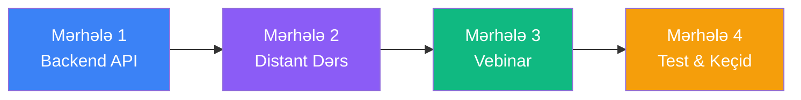

# 🎯 PeerJS → LiveKit Keçid Analizi və Məsləhət

## TL;DR — Qısa Cavab

**Bəli, LiveKit-ə keçid düzgün qərardır** — amma bunu **tələsmədən, paralel strategiya ilə** etməlisiniz. Aşağıda niyə, necə və hansı risklərlə birlikdə izah edirəm.

---

## 📊 Mövcud Sistemin Analizi (Nə Var?)

Kodu tam araşdırdım. Sizin mövcud PeerJS istifadəniz **3 əsas faylda** cəmlənib:

| Fayl | Rolu | PeerJS İstifadə Dərinliyi |
|:---|:---|:---|
| `student/live-view.php` | Tələbə dərsə qoşulur, müəllim videosunu izləyir | **Ağır** — ~400 sətir PeerJS/WebRTC kodu |
| `teacher/live-studio.php` | Müəllim dərs yayımlayır | **Ağır** — 4300+ sətirlik nəhəng fayl (amma PeerJS kodu ayrıca `temp.js`-dədir) |
| `webinar/studio.php` + `view.php` | Kütləvi vebinar yayımı | **Orta** — vebinar modulu |

### Mövcud PeerJS Arxitekturanızın Güclü Tərəfləri ✅
1. **İşləyir** — hazırda tələbələr qoşulur, video gəlir
2. **Sadə infrastruktur** — xüsusi server lazım deyil (`0.peerjs.com` cloud istifadə olunur)
3. **TURN credentials API-si artıq var** (`api/get_turn_credentials.php`) — NAT keçidini həll edirsiniz
4. **Data channel mövcuddur** — chat, fayl paylaşımı, mic request, whiteboard, kick, notification hamısı PeerJS data connection üzərindən işləyir
5. **Freeze watchdog** — video donma aşkarlanması mövcuddur
6. **Cloud/Lokal fallback** — lokal server tapılmasa avtomatik `0.peerjs.com`-a keçid var

### Mövcud PeerJS Arxitekturanızın Zəif Tərəfləri ❌
1. **Mesh problemi** — 5+ nəfər kameranı açanda hər kəs hər kəsə video upload edir → şəbəkə çökür
2. **Qeydiyyat brauzerdədir** — chunk yükləmə internet yükünü artırır
3. **Simulcast yoxdur** — zəif internetdə video ya gəlir ya da gəlmir, arada keyfiyyət yoxdur
4. **Role-based access yoxdur** — Admin gizli qala bilmir, force mute server tərəfdən deyil
5. **Reconnection zəifdir** — əl ilə yazılmış workaround-lar var, amma native deyil

---

## ⚖️ Risk-Fayda Analizi

### Faydalar (LiveKit-ə keçsəniz)

| Fayda | Təsir Dərəcəsi |
|:---|:---|
| **Mesh problemi həll olur** — müəllim 1 dəfə serverə göndərir, server paylayır | 🔴 Kritik |
| **Server-side recording** — brauzer yükü sıfır olur | 🔴 Kritik |
| **Simulcast / Adaptive Bitrate** — zəif internet = aşağı keyfiyyət, amma donma yox | 🟠 Yüksək |
| **Native reconnection** — SDK özü bərpa edir | 🟠 Yüksək |
| **Role sistemi (JWT)** — Admin, Müəllim, Tələbə, Qonaq rolları | 🟡 Orta |
| **Active Speaker Detection** — server tərəfindən kim danışır, avtomatik | 🟡 Orta |
| **Screen Share with Audio** — ekran + səs birlikdə | 🟡 Orta |

### Risklər (Keçid zamanı)

| Risk | Dərəcə | İzahı |
|:---|:---|:---|
| **Server xərci** | 🔴 Yüksək | LiveKit üçün VPS lazımdır (minimum 2 vCPU, 4GB RAM). Docker + LiveKit Server + Egress. Aylıq ~$20-40 |
| **DevOps mürəkkəbliyi** | 🔴 Yüksək | Docker, SSL, alt-domen, TURN konfigurasiyanı siz quracaqsınız. Bu PeerJS-in ən böyük üstünlüyü idi — heç nə qurmaq lazım deyildi |
| **Data Channel refaktoring** | 🟠 Orta | Hal-hazırda chat, whiteboard, mic request, file share, kick, notification hamısı `dataConn.send()` ilə gedir. LiveKit-də bunlar `room.localParticipant.publishData()` ilə olacaq — **hər birini yenidən yazmaq** lazımdır |
| **Test yükü** | 🟠 Orta | Hər iki modul (webinar + distant dərs) üçün 2x test lazımdır |
| **Mövcud tələbələrin təcrübəsi** | 🟡 Aşağı | UI dəyişmir, sadəcə arxitektura dəyişir — tələbə fərqini hiss etməməlidir |

---

## 🏗️ Keçid Strategiyası — Məsləhətim

### Strategiya: "Paralel İnkişaf" (Zero Downtime)

> [!IMPORTANT]
> **Köhnə faylları SİLMƏYİN.** Yeni `_livekit` suffixli fayllar yaradın. Köhnə sistem işləməyə davam etsin. Yeni sistem hazır olanda bir `config` dəyişəni ilə keçid edin.

### Mərhələlər



#### Mərhələ 1: Backend Hazırlığı (1-2 gün)
- `.env`-ə `LIVEKIT_URL`, `LIVEKIT_API_KEY`, `LIVEKIT_API_SECRET` əlavə edin
- `api/livekit_token.php` yaradın — JWT token generator (universal)
- Composer yoxdursa, sadə PHP JWT class yazın (`firebase/php-jwt` paketi)
- LiveKit serveri Docker ilə VPS-də qaldırın

#### Mərhələ 2: Distant Dərs Modulu (3-5 gün)
- `teacher/live-studio_livekit.php` — PeerJS çıxarıb LiveKit Publish
- `student/live-view_livekit.php` — PeerJS çıxarıb LiveKit Subscribe
- **Ən çətin hissə:** Data channel refactoring (chat, whiteboard, mic, kick, notification)

#### Mərhələ 3: Vebinar Modulu (2-3 gün)
- `webinar/studio_livekit.php` — Publisher
- `webinar/view_livekit.php` — Subscriber

#### Mərhələ 4: Test & Canlıya Çıxış (2-3 gün)
- 3+ cihazdan test
- Incognito rejimində Qonaq Link testi
- Config ilə keçid (flag ilə köhnə/yeni arasında switch)

---

## 💡 Əlavə Məsləhətlər

### 1. Data Channel Strategiyası

> [!WARNING]
> **Bu ən çox diqqət tələb edən hissədir.** Hal-hazırda `dataConn.send({type: 'chat', ...})` ilə göndərilən 12+ mesaj tipi var:
> - `chat`, `file`, `mic_approved`, `mic_rejected`, `mute_force`
> - `whiteboard_approved`, `whiteboard_rejected`, `whiteboard_force_stop`
> - `notification`, `screen_share_approved`, `screen_share_rejected`
> - `kick_user`, `lesson_ended`, `refresh_stream`
>
> Bunların hamısını LiveKit `DataPacket` API-sinə köçürmək lazımdır. Məntiqi eyni qalacaq, sadəcə transport dəyişəcək.

**LiveKit ekvivalenti:**
```javascript
// Göndərmə (PeerJS)
dataConn.send({ type: 'chat', message: msg });

// Göndərmə (LiveKit)
const encoder = new TextEncoder();
const data = encoder.encode(JSON.stringify({ type: 'chat', message: msg }));
room.localParticipant.publishData(data, DataPacket_Kind.RELIABLE);
```

### 2. Əgər Server Qura Bilmirsinizsə — LiveKit Cloud

LiveKit-in öz cloud xidməti var: [livekit.io/cloud](https://livekit.io/cloud). Pulsuz tier-i var (aylıq 50 participant-hours). Test üçün idealdır. Production üçün ~$0.006/participant-minute.

> [!TIP]
> **Tövsiyəm:** Əvvəlcə LiveKit Cloud ilə başlayın (pulsuz). Kod hazır olanda VPS-ə köçürün.

### 3. `livekit-client` SDK

Frontend üçün `livekit-client` JavaScript SDK istifadə edin:
```html
<script src="https://unpkg.com/livekit-client/dist/livekit-client.umd.min.js"></script>
```

Bu, `peerjs.min.js`-in yerini tutacaq. API-si çox oxşardır:
```javascript
const room = new LivekitClient.Room();
await room.connect(LIVEKIT_URL, token);
// Kamera açmaq
await room.localParticipant.enableCameraAndMicrophone();
```

### 4. Nə Dəyişməyəcək

Aşağıdakı hissələr **toxunulmaz** qalacaq:
- ✅ `start_live_class.php` — dərs başlatma API (yalnız kiçik əlavə: LiveKit room yaratma)
- ✅ Dashboard, UI dizayn, sidebar
- ✅ Verilənlər bazası strukturu (kiçik əlavə: `guest_token` sütunu)
- ✅ Chat UI, whiteboard UI, davamiyyət UI
- ✅ Heartbeat sistemi
- ✅ TMİS inteqrasiyası

---

## 🎯 Son Sözüm

| Sual | Cavab |
|:---|:---|
| LiveKit-ə keçmək lazımdır? | **Bəli**, xüsusən 5+ nəfərli dərslərdə Mesh arxitekturası işləmir |
| Nə vaxt? | **Tələsmə.** Əvvəl LiveKit Cloud-da prototip hazırla, sonra production-a keçir |
| Ən çətin hissə nədir? | **Data channel refactoring** — 14 mesaj tipini yenidən yazmaq |
| Ən asan hissə nədir? | **Video/audio streaming** — LiveKit SDK bunu 3-4 sətir kodla həll edir |
| Server lazımdır? | **Bəli**, amma əvvəl LiveKit Cloud (pulsuz) ilə başla |
| Köhnə kodu silmək? | **Xeyr!** Paralel fayllar yarat, config ilə keçid et |

---

> [!CAUTION]
> **Ən Böyük Səhv:** Birbaşa `live-studio.php`-ni dəyişdirmək. **Əsla etməyin.** Kopya yaradın, LiveKit versiyasını ayrıca inkişaf etdirin. Hazır olana kimi köhnə sistem işləsin.

---

## 🔬 ƏLAVƏ BÖLMƏ: LiveKit Üçün Laravel-ə Keçid Lazımdırmı?

### Qısa Cavab: **Xeyr. Qəti şəkildə lazım deyil.** ❌

Bu bölmə LiveKit inteqrasiyası üçün Laravel-ə keçidin niyə **lazımsız, zərərli və vaxt itkisi** olduğunu maddə-maddə, texniki dəlillərlə izah edir.

---

### 📐 Maddə 1: LiveKit-in Arxitekturasını Başa Düşmək

LiveKit sistemi **2 tam müstəqil hissədən** ibarətdir:

```
┌──────────────────────────────────────┐
│         BACKEND (PHP)                │
│                                      │
│  Tək vəzifəsi:                       │
│  ✅ JWT Token yaratmaq (~50 sətir)   │
│  ✅ Room yaratmaq/silmək (cURL)      │
│  ✅ Recording başlatmaq (cURL)       │
│                                      │
│  Laravel lazımdır? ❌ XEYİR          │
└──────────────┬───────────────────────┘
               │ Token (string)
               ▼
┌──────────────────────────────────────┐
│         FRONTEND (JavaScript)        │
│                                      │
│  Əsas iş burada baş verir:          │
│  🎥 Kamera/mikrofon idarəsi         │
│  📡 LiveKit serverə qoşulma         │
│  💬 Chat, whiteboard, data channel  │
│  🖥️ Ekran paylaşımı                │
│  📊 UI, UX, animasiyalar            │
│                                      │
│  Laravel lazımdır? ❌ XEYİR          │
│  (JavaScript framework-ü ilə        │
│   heç bir əlaqəsi yoxdur)           │
└──────────────────────────────────────┘
```

**Nəticə:** LiveKit-in işləməsi üçün backend tərəfdə **sadəcə 1 PHP faylı** lazımdır — JWT token yaradan fayl. Bu faylı yazmaq üçün Laravel kimi nəhəng framework lazım deyil. Bu, "bir mismar vurmaq üçün kran gətirmək" kimidir.

---

### 📐 Maddə 2: PHP-nin LiveKit İnteqrasiyası Üçün Yerinə Yetirməli Olduğu İşlər

LiveKit ilə backend PHP-nin tək 3 işi var. Hər birini native PHP ilə necə etmək olduğunu göstərirəm:

#### İş 1: JWT Token Yaratmaq ✅

```php
// api/livekit_token.php — CƏMİ ~50 SƏTİR

// .env-dən oxu (artıq mövcud mexanizmlə)
$apiKey    = getenv('LIVEKIT_API_KEY');
$apiSecret = getenv('LIVEKIT_API_SECRET');

// JWT payload
$payload = [
    'iss' => $apiKey,                    // Kim göndərir
    'exp' => time() + 86400,             // 24 saat keçərli
    'sub' => $userId,                    // İstifadəçi ID
    'name' => $userName,                 // İstifadəçi adı
    'video' => [
        'room'     => $roomName,         // Otaq adı
        'roomJoin' => true,              // Otağa qoşulma icazəsi
        'canPublish' => $isTeacher,      // Müəllim: bəli, Tələbə: xeyr
        'canSubscribe' => true           // Hamı izləyə bilər
    ]
];

// JWT imzala (firebase/php-jwt YAXUD əl ilə yazılmış class)
$token = JWT::encode($payload, $apiSecret, 'HS256');
echo json_encode(['token' => $token]);
```

**Laravel ekvivalenti nə edərdi?** Eyni şeyi — `JWT::encode()`. Heç bir fərq yoxdur.

#### İş 2: Room Yaratmaq/Silmək (opsional) ✅

```php
// LiveKit Server API-sinə sadə cURL sorğusu
$ch = curl_init('https://distant-l.ndu.edu.az/twirp/livekit.RoomService/CreateRoom');
curl_setopt_array($ch, [
    CURLOPT_POST => true,
    CURLOPT_HTTPHEADER => [
        'Authorization: Bearer ' . $adminToken,
        'Content-Type: application/json'
    ],
    CURLOPT_POSTFIELDS => json_encode(['name' => $roomName]),
    CURLOPT_RETURNTRANSFER => true
]);
$response = curl_exec($ch);
```

**Laravel ekvivalenti nə edərdi?** `Http::post()` — eyni cURL-un gözəl wrapper-i. Funksional fərq: **SIFIR**.

#### İş 3: Recording Başlatmaq (Egress) ✅

```php
// Yenə sadə cURL
$ch = curl_init('https://distant-l.ndu.edu.az/twirp/livekit.Egress/StartRoomCompositeEgress');
// ... eyni pattern, eyni cURL
```

**Yekun:** PHP-nin LiveKit üçün etdiyi 3 işin hamısı native PHP ilə **rahat, təmiz və sadə** şəkildə yazılır.

---

### 📐 Maddə 3: Bu Layihənin Mövcud Strukturu Artıq Mükəmməldir

Kodu analiz etdikdə aşağıdakı **artıq hazır olan professional infrastrukturu** gördüm:

| Komponent | Mövcud Fayl | Status |
|:---|:---|:---|
| **Database Abstraction (ORM)** | `teacher/config/database.php` | ✅ PDO ilə tam işləyən Database class — `fetch()`, `insert()`, `update()`, `delete()`, `query()` |
| **Authentication System** | `teacher/includes/auth.php` | ✅ TMİS SSO ilə inteqrasiya olunmuş Auth class |
| **Environment Loading** | `database.php` içində | ✅ `.env` faylından `putenv()` ilə dəyişənləri oxuyan mexanizm |
| **API Pattern** | `teacher/api/*.php`, `api/*.php` | ✅ JSON response qaytaran REST API-lər |
| **TURN Server API** | `api/get_turn_credentials.php` | ✅ Metered.ca ilə inteqrasiya, cURL ilə credential alma |
| **Session Management** | `includes/auth.php` | ✅ Multi-session dəstəyi (student/teacher) |
| **File Upload** | `api/upload_chat_file.php` | ✅ FormData ilə fayl yükləmə |

> [!IMPORTANT]
> **Laravel-ə keçsəniz, yuxarıdakı hər bir komponenti YENİDƏN yazmaq lazımdır:**
> - `Database` class → Laravel Eloquent-ə
> - `Auth` class → Laravel Auth middleware-ə  
> - `.env` loading → Laravel-in öz env sisteminə
> - API endpointlər → Laravel Controller-lərə
> - Session management → Laravel session driver-ə
> - TMİS SSO inteqrasiyası → Laravel adapter-ə
>
> **Bu minimum 2-3 ay əlavə iş deməkdir. LiveKit inteqrasiyası isə 1-2 həftədir.**

---

### 📐 Maddə 4: "Laravel-in Üstünlükləri" Arqumentinin Təhlili

Bəzən deyilir ki, "Laravel daha yaxşıdır çünki X var". Gəlin hər arqumenti bir-bir yoxlayaq:

| Arqument | Cavab |
|:---|:---|
| "Laravel-də routing var" | Sizin layihədə hər API ayrı PHP fayldır (`start_live_class.php`, `heartbeat.php`...). Bu artıq routing-dir — sadəcə fayl-əsaslı routing. **LiveKit üçün 1 yeni fayl əlavə etmək** 5 saniyə çəkir. |
| "Laravel-də ORM var" | Sizin `Database` class-ında `fetch()`, `insert()`, `update()` var. LiveKit inteqrasiyası üçün **yeni tablo yaratmaq lazım deyil**. Mövcud `live_classes` tablosu kifayətdir. |
| "Laravel-də middleware var" | Sizin `requireInstructor()` funksiyası artıq middleware rolunu oynayır. LiveKit token API-si üçün eyni funksiyanı çağıracaqsınız. |
| "Laravel daha təhlükəsizdir" | JWT token yaratma zamanı təhlükəsizliyi **LiveKit SDK özü** təmin edir (HMAC-SHA256 imzalama). Framework-dən asılı deyil. |
| "Laravel-in ekosistemi var" | LiveKit-in PHP SDK-sı (əgər istifadə etmək istəsəniz) **Composer paketi**dir. Composer paketi istifadə etmək üçün Laravel **lazım deyil**. `composer require` istənilən PHP layihəsində işləyir. |
| "Laravel-də queue var (arxa fon işlər)" | Sizin layihədə `fastcgi_finish_request()` ilə arxa fon əməliyyatları artıq mövcuddur (`start_live_class.php`, sətir 168-181). Bu pattern LiveKit üçün kifayətdir. |
| "Gələcəkdə Laravel lazım olacaq" | Gələcəkdə layihə böyüsə, **o zaman** keçid etmək olar. Amma **LiveKit inteqrasiyası üçün** framework dəyişmək məntiqi deyil — bu yanlış vaxtda yanlış qərardır. |

---

### 📐 Maddə 5: Vaxt və Resurs Müqayisəsi

```mermaid
graph TB
    subgraph A["YOL 1: Native PHP + LiveKit<br/>⏱️ 1-2 həftə"]
        A1["1 gün: api/livekit_token.php yaz"]
        A2["3-5 gün: Distant dərs modulunu köçür"]
        A3["2-3 gün: Vebinar modulunu köçür"]
        A4["2-3 gün: Test et"]
        A1 --> A2 --> A3 --> A4
    end
    
    subgraph B["YOL 2: Laravel-ə keçid + LiveKit<br/>⏱️ 3-4 ay"]
        B1["2 həftə: Laravel layihə qur"]
        B2["3-4 həftə: Database, Auth, API köçür"]
        B3["2 həftə: TMİS SSO inteqrasiya"]
        B4["2 həftə: Frontend köçür"]
        B5["1-2 həftə: LiveKit inteqrasiya"]
        B6["2 həftə: Test et"]
        B1 --> B2 --> B3 --> B4 --> B5 --> B6
    end
```



| Metr | Native PHP + LiveKit | Laravel + LiveKit |
|:---|:---|:---|
| **Vaxt** | 1-2 həftə | 3-4 ay |
| **Risk** | Aşağı (mövcud kod toxunulmur) | Çox yüksək (bütün sistem yenidən yazılır) |
| **Tələbələrə təsir** | Sıfır (paralel inkişaf) | Uzun downtime riski |
| **LiveKit-ə spesifik fayda** | Eyni | Eyni |
| **Nəticə** | ✅ **Məntiqli** | ❌ **Lazımsız** |

---

### 📐 Maddə 6: Real Dünya Nümunələri

LiveKit-in **rəsmi nümunə layihələri** (Examples) native PHP ilə işləyir:

1. **LiveKit Server SDK PHP** — `composer require livekit/livekit-server-sdk` — bu paket **heç bir framework tələb etmir**. Sadə PHP-də işləyir.
2. LiveKit-in rəsmi sənədlərindəki PHP nümunələri Laravel deyil, **native PHP** ilə yazılıb.
3. Dünyanın ən böyük LiveKit istifadəçiləri (tele-medicine, online education platformaları) çoxu Node.js, Go, Python istifadə edir — **heç biri "framework dəyişmək lazımdır" demir**.

> [!TIP]
> **Qayda:** Framework seçimi **layihənin ümumi arxitekturası** üçün verilən qərardır, **bir kitabxananın inteqrasiyası** üçün deyil. LiveKit kimi xarici xidmət inteqrasiyası üçün framework dəyişmək — **mühəndislik xətasıdır**.

---

### 📐 Maddə 7: Nə Vaxt Laravel-ə Keçmək Məntiqli Olardı?

Ədalətli olmaq üçün, Laravel-in həqiqətən lazım olacağı ssenarilər:

| Ssenari | İzah |
|:---|:---|
| Layihəni **sıfırdan** yenidən yazırsınız | Bəli — amma mövcud işləyən sistemi yenidən yazmağa heç bir səbəb yoxdur |
| **10+ developer** eyni vaxtda işləyir | Laravel-in MVC strukturu böyük komandalarda kodu təşkil etməyə kömək edir. 1-2 nəfərlik komandada lazım deyil |
| **Mürəkkəb REST API** sistemi qurursunuz (100+ endpoint) | Laravel-in API Resource, Form Request, Policy sistemi faydalıdır. Sizin layihədə ~15-20 endpoint var — native PHP ilə idarə olunur |
| **Artıq Laravel bilirsinizsə** və yeni layihə başlayırsınızsa | O zaman məntiqi olar. Amma **mövcud işləyən PHP layihəni** Laravel-ə köçürmək → risk, vaxt itkisi |

---

### 🏆 Yekun Qərar

```
╔══════════════════════════════════════════════════════════════╗
║                                                              ║
║   LiveKit inteqrasiyası üçün Laravel-ə keçid:               ║
║                                                              ║
║   ❌ LAZIM DEYİL                                             ║
║   ❌ VAXT İTKİSİDİR (3-4 ay vs 1-2 həftə)                  ║
║   ❌ RİSKLİDİR (mövcud işləyən sistemi pozma ehtimalı)      ║
║   ❌ HEÇ BİR ƏLAVə TEXNİKİ FAYDA VERMİR                   ║
║                                                              ║
║   Düzgün yol:                                                ║
║   ✅ Native PHP-yə 1 fayl əlavə et (JWT token)              ║
║   ✅ JavaScript-də livekit-client SDK istifadə et            ║
║   ✅ Mövcud sistemə toxunma, paralel inkişaf et              ║
║   ✅ 1-2 həftədə LiveKit tamamilə hazır olsun                ║
║                                                              ║
╚══════════════════════════════════════════════════════════════╝
```

> [!CAUTION]
> **Dostunuza deyin:** "Laravel gözəl framework-dür, amma bu layihəyə **indi** keçmək — xəstəliyə çarə tapmaq əvəzinə xəstəxananı yenidən tikmək kimidir. Xəstəliyimiz PeerJS-dir, dərmanımız LiveKit-dir, xəstəxanamız (PHP infrastrukturumuz) sağlamdır."
