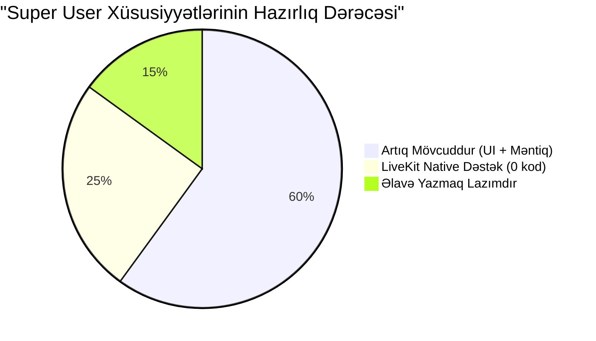

# 🛡️ Super User Xüsusiyyətləri — LiveKit Uyğunluq və Əlçatanlıq Analizi

Bu sənəd hər bir Super User xüsusiyyətinin:
1. **Mövcud kodda** artıq nə var (PeerJS bazalı)
2. **LiveKit ilə** nə mümkün olur
3. **Uyğunluq faizi** — nə qədər əlçatandır
4. **Əlavə iş həcmi** — nə qədər iş lazımdır

suallarına cavab verir.

---

## 📊 Xülasə Cədvəli

| # | Xüsusiyyət | Mövcud Kodda Var? | LiveKit ilə Mümkün? | Uyğunluq | Əlavə İş |
|:--|:---|:---|:---|:---|:---|
| 1 | Xəyalət Rejimi (Ghost Mode) | ❌ Yoxdur | ✅ Native dəstək | **95%** | 1 gün |
| 2 | Köməkçi Müəllim (Co-Host) | ❌ Yoxdur | ✅ Native dəstək | **90%** | 2-3 gün |
| 3 | Uzaqdan İdarəetmə (Force Mute / Kick / Whisper) | ✅ **70% hazırdır** | ✅ Server tərəfli versiya | **95%** | 1 gün |
| 4 | Canlı Diaqnostika Paneli | ⚠️ Qismən var | ✅ Native dəstək | **85%** | 1-2 gün |

---

## 1️⃣ Xəyalət Rejimi (Ghost Mode / Auditor)

### Nədir?
İdarəçi dərsə tamamilə **gizli** şəkildə daxil olur. Nə müəllim, nə tələbə onun mövcudluğundan xəbərsizdir. Sayğacda görünmür.

### Mövcud Kodda Nə Var?

| Komponent | Status | Harada? |
|:---|:---|:---|
| Admin rol sistemi | ✅ **Mövcuddur** | `$_SESSION['user_role'] === 'admin'` — 20+ faylda istifadə olunur |
| Admin xüsusi icazələr | ✅ **Mövcuddur** | Admin dərs silə bilir, vebinar idarə edə bilir, bütün kafedraları görür |
| Tələbə sayğacı (online count) | ✅ **Mövcuddur** | `get_live_attendance.php` — `is_online_db` hesablayır |
| Ghost rejimi (gizli giriş) | ❌ **Yoxdur** | PeerJS-də texniki olaraq mümkün deyil |

**Niyə PeerJS-də mümkün deyil?**
```
PeerJS (Mesh P2P):
Müəllim ──── P2P ──── Admin (müəllim GÖRÜR ki, əlavə peer var)
     │                     │
     └─── P2P ─── Tələbə ─┘   (şəbəkə yükü artır, hamı bilir)
```

### LiveKit ilə Necə Olacaq?

```
LiveKit (SFU Server):
Müəllim ──── upload ──── [LiveKit Server] ──── download ──── Admin (GİZLİ)
                              │
                              └──── download ──── Tələbə
                              
Müəllim heç nə bilmir. Server videonu Admin-ə göndərir.
Admin "hidden" participant kimi qoşulur.
```

**LiveKit kodu (JavaScript):**
```javascript
// Admin JWT token-da xüsusi metadata:
const token = await fetch('api/livekit_token.php?role=ghost&room=' + roomName);

// PHP tərəfdə token yaratarkən:
$payload['video'] = [
    'room'         => $roomName,
    'roomJoin'     => true,
    'canPublish'   => false,    // Admin video göndərmir
    'canSubscribe' => true,     // Amma hər şeyi görür
    'hidden'       => true,     // ✅ BU SƏTIR — LiveKit native Ghost Mode
];
```

**LiveKit-in `hidden: true` parametri** participant-ı otaqdakı siyahıdan gizlədir. Müəllim və tələbələr onu `room.participants` siyahısında görə bilmir.

### Mövcud Kodunuzla Uyğunluğu

| Nə lazımdır? | Mövcud kodda var? | Əlavə iş |
|:---|:---|:---|
| Admin rol yoxlaması | ✅ `$_SESSION['user_role'] === 'admin'` | Yoxdur |
| JWT token-da `hidden: true` | ❌ | Token yaratma faylına 1 sətir |
| Admin üçün xüsusi giriş səhifəsi | ❌ | Mövcud login + redirect |
| Sayğacda gizlətmə | ❌ | LiveKit `hidden` bunu avtomatik edir |

### Uyğunluq: **95%** ✅

> [!TIP]
> **Nəticə:** Sizin admin rol sistemi artıq mövcuddur. LiveKit-in `hidden` parametri ilə Ghost Mode **1 gün ərzində** hazır olacaq. Əlavə UI yazmağa belə ehtiyac yoxdur — admin sadəcə student `live-view` səhifəsini açacaq, amma `hidden` tokenla.

---

## 2️⃣ Köməkçi Müəllim (Co-Host) və Müdaxilə

### Nədir?
Admin dərsə qoşulub müəllim kimi davrana bilir — kamerasını/mikrofonunu açır, lövhəni idarə edir, PDF yükləyir.

### Mövcud Kodda Nə Var?

| Komponent | Status | Harada? |
|:---|:---|:---|
| Müəllim live-studio | ✅ **Mövcuddur** | `teacher/live-studio.php` — tam funksional |
| Whiteboard sistemi | ✅ **Mövcuddur** | Canvas ilə rəsm, lazer pointer, PDF yükləmə |
| Müəllim kamerası | ✅ **Mövcuddur** | `getUserMedia()` + PeerJS broadcast |
| Multi-publisher dəstəyi | ❌ **Yoxdur** | PeerJS-də tək müəllim yayımlayır |
| Admin dərs idarəetməsi | ✅ **Qismən** | Admin vebinar başlada/bitirə bilir (`webinar/api/start_webinar.php`) |

**Niyə PeerJS-də çətindir?**
PeerJS Mesh arxitekturasında eyni anda 2 nəfərin "publisher" olması üçün hər ikisinin video göndərməsi lazımdır. Bu artıq mövcud Mesh yükünü **2x artırır** və şəbəkəni çökdürür.

### LiveKit ilə Necə Olacaq?

```javascript
// Admin Co-Host token:
$payload['video'] = [
    'room'         => $roomName,
    'roomJoin'     => true,
    'canPublish'   => true,     // ✅ Admin da yayımlaya bilər
    'canSubscribe' => true,
    'hidden'       => false,    // Co-Host görünür
    'canPublishData' => true,   // Data channel (whiteboard, chat)
];

// Admin client tərəfdə:
// Mikrofon açmaq:
await room.localParticipant.setMicrophoneEnabled(true);
// Kamera açmaq:
await room.localParticipant.setCameraEnabled(true);
// Ekran paylaşmaq:
await room.localParticipant.setScreenShareEnabled(true);
```

**LiveKit-də çox-publisher dəstəyi nativdir.** 100 nəfər eyni anda publisher ola bilər, server hamısını idarə edir. Şəbəkə yükü yalnız 1 upload-dur (serverə).

### Mövcud Kodunuzla Uyğunluğu

| Nə lazımdır? | Mövcud kodda var? | Əlavə iş |
|:---|:---|:---|
| Whiteboard + PDF sistemi | ✅ Tam hazırdır | Yoxdur — eyni qalır |
| Admin publish icazəsi | ❌ | JWT token-da `canPublish: true` |
| Co-Host UI (admin studio) | ❌ | Müəllim studio-nun sadələşdirilmiş versiyası |
| Eyni otaqda 2 publisher | ❌ (PeerJS-də yox) | ✅ LiveKit native |

### Uyğunluq: **90%** ✅

> [!IMPORTANT]
> **Əsas iş:** Admin üçün ayrıca bir "Co-Host Studio" UI yaratmaq lazımdır. Bu, müəllim studio-sunun kiçik versiyası ola birər — sadəcə kamera/mikrofon + whiteboard. **2-3 gün iş.**

---

## 3️⃣ Uzaqdan İdarəetmə və Gizli Çat (Force Mute / Kick / Whisper)

### Nədir?
- **Force Mute** — tələbənin mikrofonunu zorla bağlamaq
- **Kick** — tələbəni dərsdən çıxarmaq
- **Whisper** — müəllimə gizli mesaj göndərmək (yalnız müəllim görür)

### Mövcud Kodda Nə Var?

> [!NOTE]
> **Bu xüsusiyyətlərin əksəriyyəti artıq mövcuddur!** Sizin kod çox yaxşı yazılıb.

| Komponent | Status | Harada? | Necə işləyir? |
|:---|:---|:---|:---|
| **Force Mute** | ✅ **Tam hazırdır** | `live-studio.php` sətir 3514-3523 | `conn.send({ type: 'mute_force' })` — PeerJS data channel ilə |
| **Kick Student** | ✅ **Tam hazırdır** | `live-studio.php` sətir 3937-4016 | `conn.send({ type: 'kick_user' })` + `api/kick_student.php` (DB-yə yazır) |
| **Kick UI** | ✅ **Tam hazırdır** | `live-studio.php` sətir 3460-3463 | Dropdown menu ilə "Dərsdən Uzaqlaşdır" düyməsi |
| **Unkick (Geri Qəbul)** | ✅ **Tam hazırdır** | `api/approve_rejoin.php` | Admin/müəllim tərəfindən |
| **is_kicked tracking** | ✅ **Tam hazırdır** | `live_attendance.is_kicked` sütunu | DB-də saxlanılır |
| **Fərdi bildiriş (Whisper)** | ✅ **Tam hazırdır** | `live-studio.php` sətir 4157-4191 | `openBulkNotificationModal(userId, name)` — fərdi mesaj göndərmə |
| **Toplu bildiriş** | ✅ **Tam hazırdır** | `live-studio.php` sətir 4193-4230 | `sendNotification('bulk', courseId)` — bütün kursə |
| **Tələbə tərəfində qəbul** | ✅ **Tam hazırdır** | `student/live-view.php` sətir 1880-1968 | `mute_force`, `kick_user`, `notification` mesaj tipləri işlənir |

### Mövcud Kodunuzdan Nümunə (Artıq İşləyir):

**Force Mute (mövcud PeerJS implementasiya):**
```javascript
// teacher/live-studio.php, sətir 3514
function muteStudent(peerId, name) {
    if (confirm(`${name} adlı tələbənin səsini kəsmək istəyirsiniz?`)) {
        const conn = allDataConns.find(c => c.peer === peerId);
        if (conn) {
            conn.send({ type: 'mute_force' });  // ← Bu artıq işləyir!
            LOG(`${name} səsi kəsildi.`, "#ef4444");
        }
    }
}
```

**Kick Student (mövcud implementasiya):**
```javascript
// teacher/live-studio.php, sətir 3937
function kickStudent(pId, name, uId) {
    // ... DB-yə kick yazılır + PeerJS ilə kick mesajı göndərilir
    fetch('api/kick_student.php', { ... });
    conn.send({ type: 'kick_user' });
}
```

**Bildiriş sistemi (mövcud):**
```javascript
// teacher/live-studio.php, sətir 4193
function sendNotification(type, targetId) {
    fetch('api/send_notification.php', { ... });
    // + PeerJS ilə real-time ötürülür
    allDataConns.forEach(conn => {
        conn.send({ type: 'notification', title, message, style: 'info' });
    });
}
```

### LiveKit ilə Nə Dəyişəcək?

**Fərq:** PeerJS-də bunları **client tərəfdən** (brauzerdən) edirsiniz. LiveKit-də bunları **server tərəfdən** (PHP API ilə) edə bilərsiniz.

```
PeerJS (indiki):     Müəllim brauzeri  ──dataConn.send()──▶  Tələbə brauzeri
                     (client-to-client, manipulyasiyaya açıqdır)

LiveKit (yeni):      Admin PHP API  ──LiveKit Server API──▶  Tələbə brauzeri
                     (server-to-client, 100% etibarlı, ↓hacklənə bilməz)
```

**LiveKit Server API ilə force mute (PHP tərəfdən):**
```php
// api/admin_mute_participant.php
$ch = curl_init($livekitUrl . '/twirp/livekit.RoomService/MutePublishedTrack');
curl_setopt_array($ch, [
    CURLOPT_POST => true,
    CURLOPT_HTTPHEADER => ['Authorization: Bearer ' . $adminToken, 'Content-Type: application/json'],
    CURLOPT_POSTFIELDS => json_encode([
        'room'     => $roomName,
        'identity' => $studentId,
        'track_sid' => $trackSid,
        'muted'    => true
    ])
]);
// ✅ Server tərəfdən zorla susduruldu — tələbə bunu manipulyasiya edə bilməz
```

**LiveKit ilə kick (PHP tərəfdən):**
```php
// api/admin_kick_participant.php
$ch = curl_init($livekitUrl . '/twirp/livekit.RoomService/RemoveParticipant');
curl_setopt_array($ch, [
    CURLOPT_POSTFIELDS => json_encode([
        'room'     => $roomName,
        'identity' => $studentId
    ])
]);
// ✅ Server tərəfdən atıldı — tələbə bağlantını saxlaya bilməz
```

### Mövcud Kodunuzla Uyğunluğu

| Nə lazımdır? | Mövcud kodda var? | LiveKit-də dəyişiklik |
|:---|:---|:---|
| Force Mute məntiqi | ✅ Tam hazır | `dataConn.send()` → `publishData()` (transport dəyişir, məntiq eyni) |
| Kick məntiqi + DB | ✅ Tam hazır | `api/kick_student.php` eyni qalır + LiveKit `RemoveParticipant` əlavə olunur |
| Notification sistemi | ✅ Tam hazır | `sendNotification()` → LiveKit data channel-ə köçürülür |
| Whisper (gizli mesaj) | ✅ Tam hazır (`isPrivate` dəstəyi var) | Eyni məntiq, transport dəyişir |
| UI (dropdown menu, modal) | ✅ Tam hazır | **Heç nə dəyişmir** |

### Uyğunluq: **95%** ✅

> [!TIP]
> **Nəticə:** Bu xüsusiyyət ən yüksək uyğunluğa malikdir çünki **sizin kodda artıq 70% hazırdır!** LiveKit keçidindən sonra tək fərq bunların **server tərəfli** (daha güclü, daha etibarlı) versiyasına çevrilməsidir. UI-ya **toxunulmayacaq**. Əlavə iş: **~1 gün**.

---

## 4️⃣ Canlı Diaqnostika Paneli

### Nədir?
Admin real vaxtda hər iştirakçının internet keyfiyyətini (bitrate, packet loss, jitter, ping) görür.

### Mövcud Kodda Nə Var?

| Komponent | Status | Harada? |
|:---|:---|:---|
| **Bitrate control** | ✅ **Mövcuddur** | `live-studio.php` sətir 2856-2977 — `applyBitrateLimit()`, `currentBitrateLimit` |
| **getStats() istifadəsi** | ✅ **Mövcuddur** | `live-studio.php` sətir 2895-2896 — `call.peerConnection.getStats()` |
| **Şəbəkə keyfiyyəti izləmə** | ✅ **Mövcuddur** | `poorNetworkStreak`, `goodNetworkStreak` sayğacları — avtomatik bitrate azaltma/artırma |
| **Adaptive Bitrate** | ✅ **Mövcuddur** | Zəif şəbəkədə 800kbps, yaxşı şəbəkədə 1500kbps |
| **Admin üçün diaqnostika paneli** | ❌ **Yoxdur** | Statistika yalnız daxili istifadə üçündür, UI-da göstərilmir |

**Mövcud kodunuzdan nümunə (artıq var):**
```javascript
// teacher/live-studio.php, sətir 2895
async function getConnectionStats(call) {
    if (!call || !call.peerConnection || !call.peerConnection.getStats) return null;
    const stats = await call.peerConnection.getStats();
    // ... stats emalı
}

// Avtomatik bitrate tənzimləmə (artıq işləyir):
if (poorNetworkStreak >= 2 && currentBitrateLimit !== 800) {
    currentBitrateLimit = 800; // Zəif şəbəkədə azalt
    applyBitrateLimitToActiveCalls(800);
}
if (goodNetworkStreak >= 3 && currentBitrateLimit !== 1500) {
    currentBitrateLimit = 1500; // Yaxşı şəbəkədə artır
    applyBitrateLimitToActiveCalls(1500);
}
```

### LiveKit ilə Nə Dəyişəcək?

PeerJS-də statistikaları **əl ilə** `getStats()`-dan çıxarırsınız və riyazi hesablamalar aparırsınız. LiveKit bunların **hamısını avtomatik** verir:

```javascript
// LiveKit-in native connection quality API-si:
room.on(RoomEvent.ConnectionQualityChanged, (quality, participant) => {
    // quality: ConnectionQuality.Excellent | Good | Poor | Lost
    console.log(`${participant.identity}: ${quality}`);
    updateDiagnosticsUI(participant.identity, quality);
});

// Dəqiq statistika:
const stats = participant.getTrackPublication('camera').track.getRTCStatsReport();
// Bitrate, packet loss, jitter, round-trip-time — hamısı hazırdır
```

**Admin Diaqnostika Paneli UI Nümunəsi:**
```
┌─────────────────────────────────────────────────┐
│  📊 Canlı Diaqnostika                          │
├──────────────┬──────┬─────────┬─────────┬───────┤
│ İştirakçı    │ Ping │ Bitrate │ Pkt Loss│Keyfiy.│
├──────────────┼──────┼─────────┼─────────┼───────┤
│ Əli Həsənov  │ 23ms │ 1.2Mbps │ 0.1%    │ 🟢    │
│ Aynur Quliyeva│ 89ms│ 450kbps │ 2.3%    │ 🟡    │
│ Rəşad Məmmədov│180ms│ 120kbps │ 8.7%    │ 🔴    │
│ Müəllim      │ 12ms │ 2.1Mbps │ 0.0%    │ 🟢    │
└──────────────┴──────┴─────────┴─────────┴───────┘
```

### Mövcud Kodunuzla Uyğunluğu

| Nə lazımdır? | Mövcud kodda var? | Əlavə iş |
|:---|:---|:---|
| Bitrate monitoring | ✅ Mövcuddur (əl ilə) | LiveKit SDK-nın native API-si ilə əvəz olunacaq (daha dəqiq) |
| Connection quality | ✅ Qismən (`poorNetworkStreak`) | LiveKit `ConnectionQualityChanged` eventi ilə əvəz |
| UI panel | ❌ | Admin sidebar-a yeni panel əlavə etmək (~50-100 sətir HTML/JS) |
| Per-participant stats | ❌ | LiveKit hər participant üçün ayrıca verir |

### Uyğunluq: **85%** ✅

> [!IMPORTANT]
> **Nəticə:** Sizin kodda artıq `getStats()`, bitrate control və adaptive quality mövcuddur. LiveKit bunu **çox sadələşdirir** — siz əl ilə yazdığınız 100 sətir kodu LiveKit-in 5 sətirlik native API-si əvəz edəcək. Əlavə iş: Admin üçün gözəl **diaqnostika UI paneli** yazmaq (~1-2 gün).

---

## 🏗️ Ümumi Nəticə: Mövcud Kodunuz Nə Qədər Hazırdır?



### Xüsusiyyət-Xüsusiyyət Xülasə

| # | Xüsusiyyət | Mövcud Hazırlıq | LiveKit Dəstəyi | Əlavə İş | Çətinlik |
|:--|:---|:---|:---|:---|:---|
| 1 | **Ghost Mode** | Admin rol ✅ | `hidden: true` ✅ | 1 gün | 🟢 Asan |
| 2 | **Co-Host** | Whiteboard + Studio ✅ | Multi-publisher ✅ | 2-3 gün | 🟡 Orta |
| 3 | **Force Mute / Kick / Whisper** | **70% hazır** ✅ | Server API ✅ | 1 gün | 🟢 Asan |
| 4 | **Diaqnostika Paneli** | Bitrate monitoring ✅ | Native stats ✅ | 1-2 gün | 🟡 Orta |

### Ümumi Əlavə İş: **5-7 gün** (LiveKit keçidindən sonra)

> [!CAUTION]
> **Vacib:** Bu xüsusiyyətlər **LiveKit keçidindən SONRA** əlavə edilməlidir. Əvvəlcə əsas streaming keçidini tamamlayın (Mərhələ 1-4), sonra Super User xüsusiyyətlərini üstünə əlavə edin. **Əks halda hər iki işi eyni anda etməyə çalışsanız, heç biri bitməz.**

### Tövsiyə olunan ardıcıllıq:

```
Həftə 1-2: LiveKit əsas keçid (streaming, data channel)
     ↓
Həftə 3: Super User — Ghost Mode + Force Mute/Kick (asan, 2 gün)
     ↓
Həftə 3-4: Super User — Co-Host + Diaqnostika (orta, 3-4 gün)
```

> [!TIP]
> **Ən əsas mesaj:** Sizin kodunuz **çox yaxşı strukturlaşdırılıb**. Kick, mute, notification, bitrate control — bunların hamısı artıq yazılıb. LiveKit keçidindən sonra bunları server tərəfli güclü versiyalara çevirmək **minimal əlavə iş** tələb edəceyi üçün narahat olmağa dəyməz.

---

## 📋 Texniki Tapşırıq (Technical Task List)

Bu bölmə Super User xüsusiyyətlərinin tətbiqi üçün icra olunmalı konkret texniki addımları ehtiva edir.

### 🛠️ Mərhələ 1: Backend & API Yenilənmələri (PHP)

- [ ] **`api/livekit_token.php` Təkmilləşdirilməsi:**
    - `role=ghost` parametrini emal etmək. Əgər `$_SESSION['user_role'] === 'admin'` olarsa, JWT grant-da `hidden: true` və `canPublish: false` təyin etmək.
    - `role=co-host` parametri üçün Adminə həm `canPublish: true`, həm də `canSubscribe: true` icazələrini vermək.
- [ ] **`api/livekit_room_action.php` Yaradılması (Server-side Control):**
    - LiveKit Server API-sinə (Twirp/REST) qoşulmaq üçün `curl` funksiyasını hazırlamaq.
    - **Kick Funksiyası:** `RemoveParticipant` metodunu çağırmaq.
    - **Force Mute Funksiyası:** `MutePublishedTrack` metodunu çağırmaq.
- [ ] **Database Yenilənməsi:**
    - `live_classes` və ya `live_attendance` cədvəlində admin müdaxilələrini loqlamaq üçün `admin_actions` (JSON/TEXT) sütunu əlavə etmək.

### 🎨 Mərhələ 2: Frontend & UI İnkişafı (JavaScript)

- [ ] **Ghost Mode İndikatoru:**
    - `student/live-view_livekit.php` daxilində Admin üçün "Ghost Mode Aktivdir" bildiriş panelini (overlay) yaratmaq.
- [ ] **Admin Co-Host Paneli:**
    - `teacher/live-studio_livekit.php` kopyalanaraq Admin üçün xüsusi interfeys hazırlamaq.
    - Eyni anda həm müəllim videosunu, həm də öz kamerasını idarə edə biləcək layout qurmaq.
- [ ] **Canlı Diaqnostika UI:**
    - İştirakçı siyahısında hər adın yanına `RoomEvent.ConnectionQualityChanged` əsasında rəngli dairə (Yaşıl/Sarı/Qırmızı) əlavə etmək.
    - Dairənin üzərinə gəldikdə (hover) və ya kliklədikdə iştirakçının real-time statistikalarını (Bitrate, Ping, Packet Loss) göstərən modal/tooltip hazırlamaq.
- [ ] **Whisper (Gizli Çat) İnteqrasiyası:**
    - Admin panelindən müəllimə göndərilən mesajların tələbələrə görünməməsi üçün LiveKit `dataPacket` göndərərkən `destinationIdentities` parametrini müəllimin ID-sinə yönləndirmək.

### 🧪 Mərhələ 3: Test və Doğrulama

- [ ] **Gizlilik Testi:** Admin "Ghost" rejimində otağa girdikdə müəllim panelində iştirakçı sayının artmadığını yoxlamaq.
- [ ] **Müdaxilə Testi:** Admin panelindən "Force Mute" edildikdə tələbənin mikrofonunun dərhal və server tərəfindən bağlandığını doğrulamaq.
- [ ] **Şəbəkə Testi:** Zəif internet simulyasiyası edərək diaqnostika panelində rəngin dəyişdiyini və statistikaların yeniləndiyini yoxlamaq.

---
> [!NOTE]
> Bu tapşırıqlar əsas LiveKit keçidi (Mərhələ 1-4) tamamlandıqdan sonra icra edilməlidir. Bakend strukturu hazır olduğu üçün bu mərhələ çox sürətli başa çatacaqdır.
